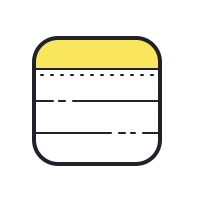

# project-documentation

<p align="center">
  <a href="" rel="noopener">
 </a>
</p>

<h3 align="center">NOTEBOOK </h3>

<div align="center">

[]()
[](https://github.com/Amit610/Spotify/issues)
[](https://github.com/kylelobo/The-Documentation-Compendium/pulls)

</div>

---

<p align="center">The **Notebook App** is a web application that allows users to create, manage, and securely store their notes. This app is designed to help users keep track of their thoughts, ideas, to-do lists, and more, all in one place.
    <br> 
</p>

## 📝 Table of Contents

- [About](#about)
- [Getting Started](#getting_started)
- [Deployment](#deployment)
- [Usage](#usage)
- [Built Using](#built_using)
- [Acknowledgments](#acknowledgement)

## 🧐 About <a name = "about"></a>

Welcome to NOTEBOOK, your trusted digital companion for note-taking and organization. Our mission is to empower you with a secure and convenient platform to capture your thoughts, ideas, and to-do lists.

At NOTEBOOK, we believe in the power of personalized notes. Whether you're a professional managing tasks or a creative soul recording inspirations, our app offers you a safe and secure space to create, update, and organize your notes with ease.

## 🏁 Getting Started <a name = "getting_started"></a>

These instructions will get you a copy of the project up and running on your local machine for development and testing purposes. See [deployment](#deployment) for notes on how to deploy the project on a live system.

### Prerequisites

What things you need to install the software and how to install them.

- Node.js and npm installed on your machine.
- MongoDB installed and a running instance.

### Installing

A step by step series of examples that tell you how to get a development env running.

Install server dependencies:

```
cd server
npm install
```

Install client dependencies:

```
cd client
npm install
npm nodemon ./index.js
```

nodemon will start the backend server

## 🔧 Running the tests For Backend <a name = "tests"></a>

for checking if routs are working properly use "Thunder client" or "Postman"

### Break down into end to end tests

To Ensure if backend is running properly

```
nodemon ./index.js
```

### For Frontend

In this we wre using Npm create-react-app

```
npm run start
```

The client should now be running on http://localhost:3000, and the server on http://localhost:5000.

## 🎈 Usage <a name="usage"></a>

Here's how you can use and interact with the Spotify Clone:

- Register a new user account on the application.
- Log in with your credentials.
- Explore and play music from the available catalog.
- Create and manage your playlists.
- Search for songs, artists, and albums.
- Enjoy the music streaming experience.

## 🚀 Deployment <a name = "deployment"></a>

To deploy your Spotify Clone on a live system, you can use various hosting platforms and services. Below are general steps on how to deploy a MERN stack application.

1. Set Up a Production-Ready Build
   Before deploying, create a production-ready build of your React frontend. In your project's client directory, run:

```
npm run build
```

This will create an optimized build of your React app in the build directory.

2. Choose a Hosting Provider
   Select a hosting provider that supports Node.js and MongoDB. Popular options include:

- Heroku
- Netlify
- Vercel
- AWS
- DigitalOcean

3. Deploy Your Backend
4. Deploy Your Frontend

## ⛏️ Built Using <a name = "built_using"></a>

- [MongoDB](https://www.mongodb.com/) - Database
- [Express](https://expressjs.com/) - Server Framework
- [ReactJs](https://react.dev/) - Web Framework
- [NodeJs](https://nodejs.org/en/) - Server Environment


## 🎉 Acknowledgements <a name = "acknowledgement"></a>

- Thanks to the NOTES APP team for the inspiration behind this project.
- If you have any questions or feedback, feel free to contact .
- Happy note-taking !

